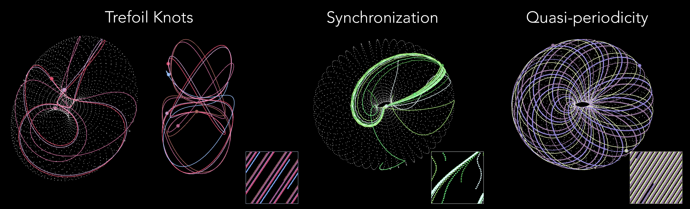
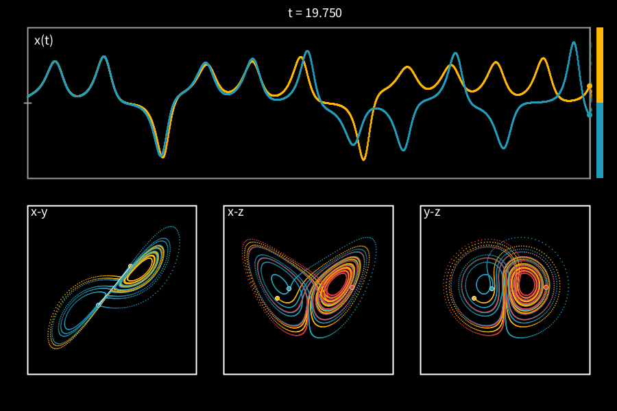
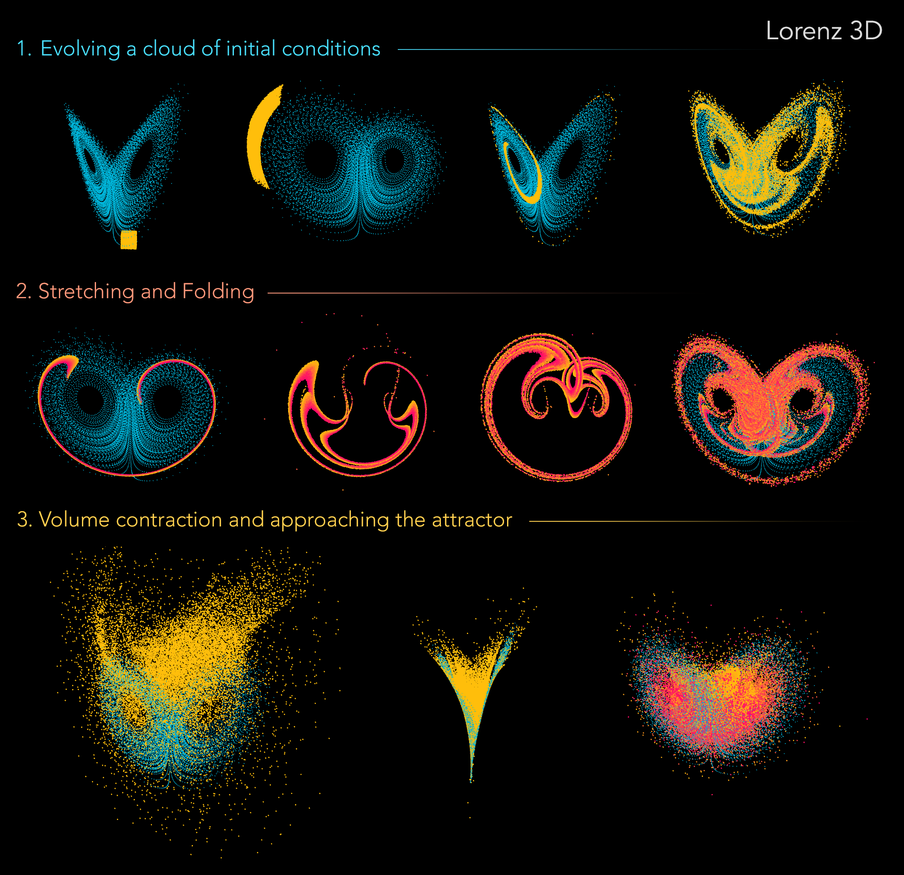
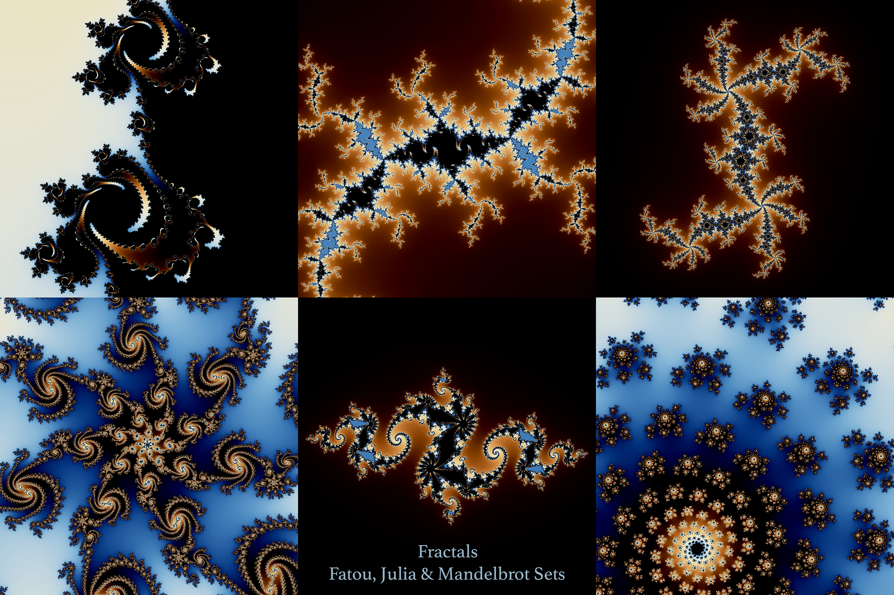

# Nonlinear Dynamics and Chaos Visualizations in Processing

Siddhartha Mukherjee,
Indian Institute of Technology - Kanpur ([Academic Website](https://www.sm-iitk.in/))

---
These were originally developed for the course [IDC601](https://github.com/siddhartha19/IITK-IDC601-Chaos-2025-26-I). 

## Contents

These tools are to let you test and play with numerical integration of dynamical systems, focusing on visualization and interactivity. To run these codes, you need to download [Processing](https://processing.org/) which is freely available (a platform for making generative art and for visual programming). The codes have been written in Java.

1. **Flow 2D (Basic)** - Flow fields from 2D systems (both linear and nonlinear), and to evolve trajectories bly clicking.
1. **Flow 2D (Advanced)** - With additional functionality allowing you to zoom in and out of the vector field, show fixed points, nullclines, toggle grid, vectors etc.   
1. **Complex Transformation** - Visualize the transformation of the complex plane under z -> z^n.
1. **Dynamics on a Torus** - Coupled oscillators (or any other 2pi period 2D systems) evolving on a Torus. You can click to add trajectories, toggle phase-plane view etc.
1. **Lorenz Pair** - Visualize evolution of 2 nearby trajectories under the Lorenz equations, with x(t) vs (t) and phase-plane projections, can toggle views, symbolic dynamics etc.
1. **Lorenz 3D** - Visualize a cloud of initial conditions evolving on the Lorenz attractor in 3D, with controls to reset and pause evolution, rotation in 3D, colour trajectories etc.
1. **Logistic Cobweb Diagram** - Interactive Cobweb diagram to observe period doublings and transition to chaos.
1. **Fractal Sets** - Visualize the Mandelbrot set, along with the Fatou and Julia sets for an introduction to Holomorphic dynamics and the recursive beauty of fractal sets. 

## Reference

**Steven H. Strogatz – *Nonlinear Dynamics and Chaos***  
Chapman & Hall, 2024 (3rd Edition), ISBN 9781032791654.
